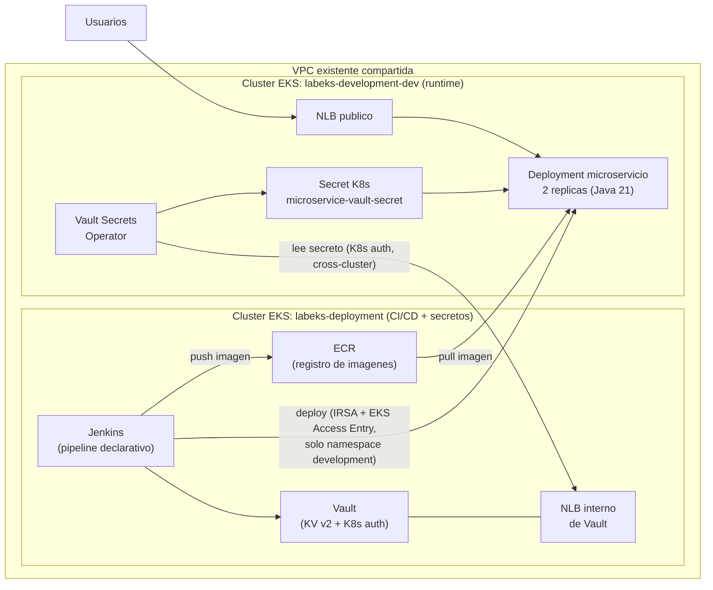
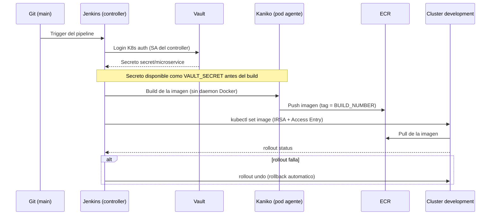

# LabEks — Prueba Técnica DevOps 2026

Solución de infraestructura como código que levanta **dos clústeres Amazon EKS** y automatiza el ciclo completo *build → secreto → despliegue* de un microservicio Java 21:

- **`labeks-deployment`** — plano de CI/CD y secretos: Jenkins, Vault, ECR e identidades IAM/IRSA.
- **`labeks-development-dev`** — plano de ejecución: dos réplicas del microservicio detrás de un Network Load Balancer.

El pipeline de Jenkins lee un secreto de Vault, lo inyecta como variable de entorno **antes del build**, construye la imagen, la publica en ECR y la despliega en el clúster de development con **rollback automático**. En runtime el secreto no se hornea en la imagen: el **Vault Secrets Operator (VSO)** lo sincroniza cross-cluster hacia un Secret de Kubernetes que el pod consume como variable de entorno.

> Todos los identificadores reales de la cuenta AWS (account ID, VPC, subredes, ARNs) se manejan con placeholders. Los valores reales viven en archivos `*.auto.tfvars` **no versionados** (ver [`terraform/README.md`](terraform/README.md)); cada uno tiene su `.example` como plantilla.

---

## Índice

1. [Arquitectura](#arquitectura)
2. [Flujo CI/CD](#flujo-cicd)
3. [Estructura del repositorio](#estructura-del-repositorio)
4. [Requisitos previos](#requisitos-previos)
5. [Despliegue paso a paso](#despliegue-paso-a-paso)
6. [Integración con Vault](#integración-con-vault)
7. [Cómo validar que el secreto fue inyectado](#cómo-validar-que-el-secreto-fue-inyectado)
8. [Buenas prácticas de Kubernetes aplicadas](#buenas-prácticas-de-kubernetes-aplicadas)
9. [Extras](#extras)
10. [Teardown](#teardown)

---

## Arquitectura



**Decisiones de diseño clave:**

- **Separación de planos**: la "fábrica" (Jenkins/Vault/ECR) queda aislada del "runtime" (microservicio), cada uno en su propio clúster con su propio security group.
- **Sin claves permanentes**: Jenkins usa **IRSA** (IAM Roles for Service Accounts vía OIDC) para push a ECR y para desplegar. El deploy cross-cluster se autoriza con **EKS Access Entries** acotadas al namespace `development` (no admin, no cluster-wide).
- **Reutilización de red**: ambos clústeres usan una VPC existente mediante `data sources` de solo lectura; no se crea ni modifica nada de la red compartida, solo se **agregan** reglas de security group aditivas.
- **Secreto en runtime desacoplado**: VSO sincroniza el secreto de Vault a un Secret nativo; el pod nunca habla con Vault directamente ni lleva el secreto en la imagen.

---

## Flujo CI/CD



**Etapas del [`jenkins/Jenkinsfile`](jenkins/Jenkinsfile):**

1. **Leer secreto de Vault, build y push a ECR** — el paso `withVault(...)` autentica contra Vault (Kubernetes auth, credencial declarada como código vía JCasC) y deja el secreto como `VAULT_SECRET` **antes** del build. La imagen se construye con **Kaniko** (los nodos EKS corren `containerd`, no `dockerd`, así que no hay socket Docker que montar) y se publica en ECR con credenciales obtenidas por IRSA.
2. **Deploy a development con rollback** — un pod agente con otra ServiceAccount (IRSA distinta, mínimo privilegio) hace `aws eks update-kubeconfig` + `kubectl set image` sobre el clúster development. Si el `rollout status` falla, ejecuta `rollout undo` y marca el build como fallido.

El repositorio del ECR se pasa como **parámetro del build** (`ECR_REPOSITORY`) porque su URI contiene el account ID, que no se versiona.

---

## Estructura del repositorio

```
LabEks/
├── terraform/
│   ├── modules/
│   │   ├── eks-cluster/                  # EKS + node group + IAM/OIDC + KMS + launch template
│   │   ├── ecr/                          # repositorio ECR + rol IRSA de push
│   │   ├── existing-network/             # data sources de la VPC/subredes existentes
│   │   ├── networking/                   # (VPC propia, no usada en el lab compartido)
│   │   └── aws-load-balancer-controller-irsa/
│   ├── infrastructure/
│   │   ├── deployment-cluster/           # stack raiz: Jenkins+Vault+ECR, IRSA, reglas SG
│   │   └── development-cluster/          # stack raiz: microservicio, Access Entry, reglas SG
│   └── environments/
│       ├── deployment/                   # terraform.tfvars + network.auto.tfvars(.example)
│       └── development/
├── microservice/                         # Spring Boot 3, Java 21, Maven + Dockerfile multi-stage
├── k8s/
│   ├── deployment-cluster/               # namespaces, values de Helm (Jenkins/Vault), SA IRSA
│   ├── development/                      # namespace, RBAC, Deployment, Service, VSO (+ CSI alt.)
│   └── extras/                           # CronJob de eventos del kubelet + CRD MicroserviceConfig
└── jenkins/                              # Jenkinsfile, politica HCL de Vault, script de setup
```

---

## Requisitos previos

- Terraform ≥ 1.6, AWS CLI v2, `kubectl`, `helm`.
- Credenciales AWS con permiso sobre la cuenta/VPC del laboratorio (perfil SSO recomendado: se auto-refresca en operaciones largas como la creación de node groups).
- Los archivos `terraform/environments/*/network.auto.tfvars` con los IDs reales de la VPC/subredes (copiar de los `.example` y rellenar).

Repositorios de Helm:

```bash
helm repo add hashicorp https://helm.releases.hashicorp.com
helm repo add jenkins https://charts.jenkins.io
helm repo add eks https://aws.github.io/eks-charts
helm repo add aws-ebs-csi-driver https://kubernetes-sigs.github.io/aws-ebs-csi-driver
helm repo update
```

---

## Despliegue paso a paso

### 1. Infraestructura (Terraform)

Cada stack se aplica por separado. Ejemplo para **deployment** (análogo para development):

```bash
cd terraform/infrastructure/deployment-cluster
terraform init
terraform apply \
  -var-file="../../environments/deployment/terraform.tfvars" \
  -var-file="../../environments/deployment/network.auto.tfvars"
```

> Si antes se corrió `terraform init -backend=false` para validación offline, reinicializar con `terraform init -reconfigure` antes del apply.

Esto crea, por clúster: el clúster EKS (con KMS dedicada para los volúmenes EBS de los nodos y launch template propio), el node group gestionado, el proveedor OIDC para IRSA, y —en deployment— el repositorio ECR y los roles IRSA (push a ECR, deploy cross-cluster, EBS CSI, ALB controller).

Guarda los outputs (se usan en los pasos siguientes):

```bash
terraform output               # ecr_repository_url, ecr_push_role_arn,
                               # jenkins_deploy_role_arn, ebs_csi_driver_role_arn,
                               # alb_controller_role_arn, ...
aws eks update-kubeconfig --name labeks-deployment      --alias deployment
aws eks update-kubeconfig --name labeks-development-dev  --alias development
```

### 2. Add-ons de clúster (Helm)

En **ambos** clústeres se instala el **AWS Load Balancer Controller** (necesario porque los Services fijan sus subredes por anotación; el proveedor in-tree legacy no lo soporta). Reemplazar `<...>` con los outputs de Terraform:

```bash
# AWS Load Balancer Controller (repetir en cada cluster con su propio role ARN)
helm install aws-load-balancer-controller eks/aws-load-balancer-controller -n kube-system \
  --set clusterName=<CLUSTER_NAME> --set region=<REGION> --set vpcId=<VPC_ID> \
  --set serviceAccount.create=true --set serviceAccount.name=aws-load-balancer-controller \
  --set 'serviceAccount.annotations.eks\.amazonaws\.com/role-arn=<ALB_CONTROLLER_ROLE_ARN>'

# EBS CSI Driver (solo en deployment; Jenkins y Vault requieren PVCs)
helm install aws-ebs-csi-driver aws-ebs-csi-driver/aws-ebs-csi-driver -n kube-system \
  --set controller.serviceAccount.create=true \
  --set controller.serviceAccount.name=ebs-csi-controller-sa \
  --set 'controller.serviceAccount.annotations.eks\.amazonaws\.com/role-arn=<EBS_CSI_ROLE_ARN>' \
  --set defaultStorageClass.enabled=true
```

### 3. Vault (clúster deployment)

```bash
kubectl --context deployment apply -f k8s/deployment-cluster/namespaces.yaml
helm install vault hashicorp/vault -n vault -f k8s/deployment-cluster/vault/values.yaml
kubectl --context deployment apply -f k8s/deployment-cluster/vault/service-internal-lb.yaml
```

Inicializar y desellar (guardar las llaves y el root token de forma segura, **fuera** del repo):

```bash
kubectl --context deployment -n vault exec -it vault-0 -- vault operator init
kubectl --context deployment -n vault exec -it vault-0 -- vault operator unseal   # 3 veces
```

Configurar el secreto, la política y el **mount de K8s auth para Jenkins** (ver [`jenkins/vault-k8s-auth-setup.sh`](jenkins/vault-k8s-auth-setup.sh)) y el **mount para VSO** (ver [`k8s/development/vault/vault-k8s-auth-setup.sh`](k8s/development/vault/vault-k8s-auth-setup.sh) y el detalle cross-cluster en [Integración con Vault](#integración-con-vault)).

### 4. Jenkins (clúster deployment)

```bash
kubectl --context deployment apply -f k8s/deployment-cluster/jenkins/build-agent-serviceaccount.yaml   # anotar ecr_push_role_arn
kubectl --context deployment apply -f k8s/deployment-cluster/jenkins/deploy-agent-serviceaccount.yaml   # anotar jenkins_deploy_role_arn
helm install jenkins jenkins/jenkins -n jenkins -f k8s/deployment-cluster/jenkins/values.yaml
```

Los plugins (`hashicorp-vault-plugin`, `docker-workflow`, `timestamper`) y la credencial de Vault se declaran como código en los `values.yaml` (JCasC). Crear el job tipo *Pipeline* apuntando a este repo, `Script Path: jenkins/Jenkinsfile`.

### 5. Microservicio y VSO (clúster development)

```bash
kubectl --context development apply -f k8s/development/namespace.yaml
kubectl --context development apply -f k8s/development/serviceaccount.yaml
kubectl --context development apply -f k8s/development/rbac.yaml
kubectl --context development apply -f k8s/development/deployment.yaml   # sustituir la imagen por la real
kubectl --context development apply -f k8s/development/service.yaml

# Vault Secrets Operator
helm install vault-secrets-operator hashicorp/vault-secrets-operator \
  -n vault-secrets-operator-system --create-namespace
kubectl --context development apply -f k8s/development/vault/token-reviewer.yaml
kubectl --context development apply -f k8s/development/vault/connection.yaml   # address = NLB interno de Vault
kubectl --context development apply -f k8s/development/vault/auth.yaml
kubectl --context development apply -f k8s/development/vault/static-secret.yaml
```

### 6. Ejecutar el pipeline

Lanzar el build en Jenkins con el parámetro `ECR_REPOSITORY` = URI del repositorio ECR (output `ecr_repository_url`). El pipeline construye, publica y despliega la imagen; los pods quedan `Running` y el NLB público expone el microservicio.

---

## Integración con Vault

**Autenticación de Jenkins** — Vault expone un mount de Kubernetes auth `kubernetes-jenkins`. El plugin de Vault resuelve el login en el **JVM del controller** de Jenkins, así que el role liga la ServiceAccount del controller (`jenkins`, namespace `jenkins`) a una política de **solo lectura** sobre `secret/microservice` ([`jenkins/vault-policy.hcl`](jenkins/vault-policy.hcl)). No hay tokens de Vault hardcodeados: la credencial es del tipo *Vault Kubernetes* declarada por JCasC.

**Autenticación de VSO (cross-cluster)** — Vault corre en el clúster *deployment* pero debe validar tokens emitidos por el clúster *development*. Esto exige tres cosas en el mount `kubernetes-development`:

1. **`token_reviewer_jwt`** — un JWT de una ServiceAccount de *development* con el ClusterRole `system:auth-delegator` ([`k8s/development/vault/token-reviewer.yaml`](k8s/development/vault/token-reviewer.yaml)). Sin él, Vault haría el `TokenReview` con su propio token (de *deployment*) y *development* lo rechazaría con `403 permission denied`.
2. **`disable_local_ca_jwt=true`** — para que Vault use el CA y el reviewer del clúster remoto, no los locales.
3. **`audience=vault`** en el role — VSO pide un token acotado a la audiencia `vault` ([`auth.yaml`](k8s/development/vault/auth.yaml)); si el role no la declara, Vault hace el `TokenReview` sin audiencia y la API rechaza el token (`invalid bearer token`).

**Inyección en runtime** — el `VaultStaticSecret` sincroniza `secret/microservice` a un Secret nativo `microservice-vault-secret` (clave `value`). El Deployment mapea esa clave a la variable `VAULT_SECRET` con `secretKeyRef` (no `envFrom`, que crearía variables con el nombre de cada clave del Secret en vez de `VAULT_SECRET`).

> El repo también incluye la **alternativa con Vault CSI Provider** en [`k8s/development/vault/csi-alternative/`](k8s/development/vault/csi-alternative/) como enfoque documentado; el flujo activo usa VSO.

---

## Cómo validar que el secreto fue inyectado

**1. VSO sincronizó el secreto:**

```console
$ kubectl --context development -n development get vaultstaticsecret microservice-secret
NAME                  SYNCED   HEALTHY   READY   AGE
microservice-secret   True     True      True    5m
```

**2. Los pods corren (2 réplicas):**

```console
$ kubectl --context development -n development get pods
NAME                            READY   STATUS    RESTARTS   AGE
microservice-78b8d5bd87-g2zls   1/1     Running   0          2m
microservice-78b8d5bd87-t9g28   1/1     Running   0          2m
```

**3. Los endpoints responden a través del NLB público:**

```console
$ LB=$(kubectl --context development -n development get svc microservice \
    -o jsonpath="{.status.loadBalancer.ingress[0].hostname}")

$ curl -s "http://$LB/api/env-secret"
{"envVarName":"VAULT_SECRET","value":"cambia-este-valor-de-vault"}

$ curl -s "http://$LB/api/config-property"
{"value":"configuracion-del-deployment-development","property":"app.config.message"}
```

- `/api/env-secret` retorna el valor que vive en `secret/microservice` de Vault, recorriendo **Vault → VSO → Secret → env var → app**.
- `/api/config-property` retorna una propiedad de configuración simulada (inyectada como `APP_CONFIG_MESSAGE` en el Deployment y leída vía `application.yml`).

---

## Buenas prácticas de Kubernetes aplicadas

- **Namespaces** por función (`jenkins`, `vault`, `development`) y **separación de ambientes** en dos clústeres.
- **RBAC de mínimo privilegio**: cada agente de Jenkins usa su propia ServiceAccount/IRSA (una solo puede tocar ECR, la otra solo el namespace `development` de otro clúster vía EKS Access Entry). Ver [`k8s/development/rbac.yaml`](k8s/development/rbac.yaml).
- **Probes**: `readinessProbe` y `livenessProbe` sobre los endpoints de Spring Boot Actuator (`/actuator/health/readiness` y `/actuator/health/liveness`).
- **Seguridad del contenedor**: `runAsNonRoot` con **UID numérico** (10001, coincidente con el `USER` del Dockerfile), `allowPrivilegeEscalation: false`, `readOnlyRootFilesystem: true` (con un `emptyDir` en `/tmp` para Tomcat).
- **Límites de recursos**: `requests`/`limits` de CPU y memoria en todos los workloads.
- **Imagen mínima**: Dockerfile multi-stage (build con Maven, runtime sobre `eclipse-temurin:21-jre-alpine`, usuario no-root).

---

## Extras

Ambos extras del enunciado están implementados en [`k8s/extras/`](k8s/extras/):

- **CronJob de auditoría del kubelet** ([`kubelet-events-cronjob.yaml`](k8s/extras/kubelet-events-cronjob.yaml)) — cada 10 min ejecuta `kubectl get events --field-selector source=kubelet` y deja los eventos en el log del Job.
- **CRD `MicroserviceConfig`** ([`microserviceconfig/`](k8s/extras/microserviceconfig/)) — define campos `logLevel`, `restartPolicy`, `healthCheckPath`, con un **controlador en Python** opcional que los procesa. Validado end-to-end contra un clúster `kind` local.

---

## Teardown

Para no dejar recursos AWS huérfanos (NLBs, volúmenes EBS), el orden importa:

```bash
# 1. Borrar Services LoadBalancer y PVCs con los clusteres aun vivos
#    (para que el ALB controller / EBS CSI limpien los recursos AWS)
kubectl --context development delete -f k8s/development/service.yaml
kubectl --context deployment  delete -f k8s/deployment-cluster/vault/service-internal-lb.yaml
kubectl --context deployment  delete pvc --all -n vault
kubectl --context deployment  delete pvc --all -n jenkins

# 2. Confirmar que no quedan ELB/EBS de nuestros clusteres, luego destruir
cd terraform/infrastructure/development-cluster && terraform destroy -var-file=...
cd ../deployment-cluster && terraform destroy -var-file=...
```
